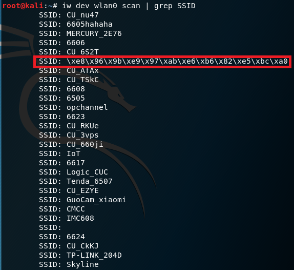
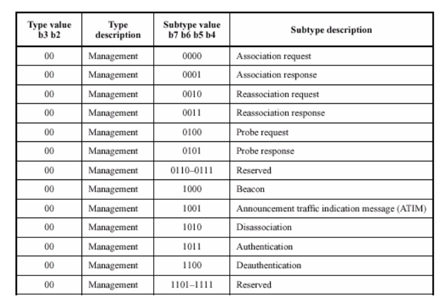

# 第二章 无线接入网实验 实验报告

## 一、实验过程
1. 查看网络设备

        ifconfig

2. 确保无线网卡的工作模式是managed，且Access Poit值为Not-Associated

        iwconfig

3. 仅查看附近无线网络的SSID,打印乱码SSID

        iw dev wlan0 scan | grep SSID

4. 仅查看附近无线网络的SSID，自动处理UTF-8编码的SSID名称

        iw dev wlan0 scan | grep SSID | xargs -0 echo -e

5. 查看无线网卡支持的无线协议类型

        iw phy phy0 channels

- 通过截图可知是支持单频（2.4GHz）无线网卡

6. 开启网卡监听模式

        # 解决部分无线网卡在Kali 2.0系统中设置监听模式失败，杀死可能会导致aircrack-ng套件工作异常的相关进程
        airmon-ng check kill

        # 设置wlan0工作在监听模式
        airmon-ng start wlan0

7. 开始抓包

        # 查看网卡监听的channel
        iw dev wlan0mon info

        # 进行抓包并保存
        airodump-ng wlan0mon --channel 10 -w 20180925 --beacons --wps

8. 使用wireshark查看包相关信息

- 共抓到6490个包，共1435kb大小

## 二、相关问题

1. 相关知识点
- 常见帧类型
  - Beacon(信标)帧
  - Probe Request(探测请求)帧
  - Probe Response(探测响应)帧
  - ATIM帧
  - Disassociation(解除关联)帧
  - Deauthentication(解除认证)帧
  - Association Request(关联请求)帧
  - Reassociation Request(重新关联请求)帧
  - Authentication(身份认证)帧

- Wi-Fi认证过程
  1. AP发送Beacon广播帧
  2. 客服端向承载指定SSID的AP发送Probe Request(探测请求)帧
  3. AP接入点对客户端的SSID连接请求进行应答
  4. 客户端对目标AP请求进行身份认证(Authentication)
  5. AP对客户端的身份认证(Authentication)请求作出回答
  6. 客户端对AP发送连接(Association)请求
  7. AP对连接(Association)请求进行回答
  8. 客户端向AP请求断开连接(Disassociation)

---
### 查看统计当前信号覆盖范围内一共有多少独立的SSID？其中是否包括隐藏SSID？

- 独立的SSID可以通过查看Beacon帧得出
- 隐藏的SSID有两种可能，一种是广播的Beacon的SSID为空或者没广播Beacon但回复了Probe Response

        $ tshark -r 20180925-01.cap -Y wlan.fc.type_subtype==0x08 -T fields -e wlan.sa -e wlan.ssid | sort -u | cat -v  > beacon.list

        # -r 设置tshark分析的输入文件
        # -Y 设置抓包的数据链路层协议，这里抓取的是Beacon(0x08)
        # -T 设置解码结果输出的格式
        # -e 添加一个字段列表显示，当-T被选中时，该命令可多次选用，这里仅仅显示地址和SSID
        # -e 输出源地址和SSID
        # cat -v 为了表示不可打印字符
        # sort -u 去除重复行

beacon.list

        00:17:16:0a:27:f0	CUCTVS
        0c:4b:54:9a:e3:da	6606
        0c:4b:54:a6:df:c9	IoT
        78:11:dc:50:ac:f6	cuc604
        7a:11:dc:50:ac:f6	
        8c:a6:df:db:b2:48	6617
        8c:a6:df:db:b4:64	6605hahaha
        8c:a6:df:dc:93:0a	opchannel
        9c:6f:52:6e:10:9b	CU_6S2T
        d4:ee:07:57:87:52	6624
        e4:f3:f5:4b:2e:76	MERCURY_2E76
        f4:83:cd:b4:20:4d	TP-LINK_204D
        fc:d7:33:4e:05:00	6602M-oM-?M-=M-oM-?M-=M-oM-?M-=M-oM-?M-=M-oM-?M-=M-oM-?M-=M-oM-?M-=M-oM-?M-=M-oM-?M-= #6602真牛逼

- 这里使用php的内置函数完成了翻译，原本想一条命令直接完成翻译工作的，但查阅了tshark的官方文档后，并尝试了iconv、od、unicode等函数后都没有成功

        $ tshark -r 20180925-01.cap -Y wlan.fc.type_subtype==5 -T fields -e wlan.sa -e wlan.ssid | sort -u |cat -v > proresponse.list

proresponse.list

        00:17:16:0a:27:f0	CUCTVS
        02:1a:11:f8:31:23	M-oM-?M-=M-oM-?M-=M-oM-?M-=M-oM-?M-=M-oM-?M-=M-oM-?M-=M-oM-?M-=M-oM-?M-=M-oM-?M-=M-oM-?M-=M-oM-?M-=M-oM-?M-=M-oM-?M-=M-oM-?M-=M-oM-?M-=M-oM-?M-=M-oM-?M-=M-oM-?M-=M-oM-?M-=M-oM-?M-=M-oM-?M-=(M-oM-?M-=M-oM-?M-=M-oM-?M-=M-oM-?M-=M-oM-?M-=M-oM-?M-=M-oM-?M-= #去吧皮卡丘♪～(´ε｀
        0c:4b:54:9a:e3:da	6606
        0c:4b:54:a6:df:c9	IoT
        78:11:dc:50:ac:f6	cuc604
        8c:a6:df:dc:93:0a	opchannel
        9c:6f:52:6e:10:9b	CU_6S2T
        d4:ee:07:57:87:52	6624
        e4:f3:f5:4b:2e:76	MERCURY_2E76
        f4:83:cd:b4:20:4d	TP-LINK_204D
        fc:d7:33:4e:05:00	6602M-oM-?M-=M-oM-?M-=M-oM-?M-=M-oM-?M-=M-oM-?M-=M-oM-?M-=M-oM-?M-=M-oM-?M-=M-oM-?M-= #6602真牛逼

- 结合截图可知，当前范围内有14个独立SSID，其中有两个隐藏SSID

        广播的Beacon的SSID为空：
        7a:11:dc:50:ac:f6
        没广播Beacon但回复了Probe Response：02:1a:11:f8:31:23 去吧皮卡丘♪～(´ε｀

Wireshark下查看7a:11:dc:50:ac:f6，可知其SSID长度为0，且类型为Wildcard SSID

----

### 哪些无线热点是加密/非加密的？加密方式是否可知？
 - 热点是否是加密的可以查看帧的wlan.fixed.capabilities.privacy段
   - 0是未加密状态
   - 1是加密状态

- 加密的方式可以通过wlan.fixed.auth.alg来进行判断
  - 0是OpenSystem，完全不认证也不加密，任何人都可以连到无线基地台使用网络
  - 1是SharedKey

----

### 如何分析出一个指定手机在抓包时间窗口内在手机端的无线网络列表可以看到哪些SSID？

- 就目前来看，在无线网卡区域内，只要收到非空的SSID的Beacon，则就能在手机端的无线网络看到

----

### 这台手机尝试连接了哪些SSID？最终加入了哪些SSID？

- 根据Probe Request帧，可以知道手机尝试连接了哪些SSID，因为手机尝试连接的时候，会广播Probe Request帧

- 最终加入了哪些SSID可以通过Association帧知道

----
### SSID包含在哪些类型的802.11帧？
- 从抓到的包来看，包含以下几种
  - Beacon frame
  - Probe Request frame
  - Probe Response frame
  - Association Request

---
### 参考资料
- [802.11协议帧格式、Wi-Fi连接交互过程、无线破解入门研究](http://www.cnblogs.com/littlehann/p/3700357.html)
- [airodump-ng的官方使用手册](http://www.aircrack-ng.org/doku.php?id=airodump-ng)
- [移动互联网安全-第二章-无线接入网监听-实验报告](https://github.com/CUCCS/2018-NS-Public-TheMasterOfMagic/blob/mis-chap0x02/mis/mis-chap0x02.md)