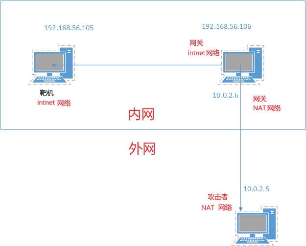
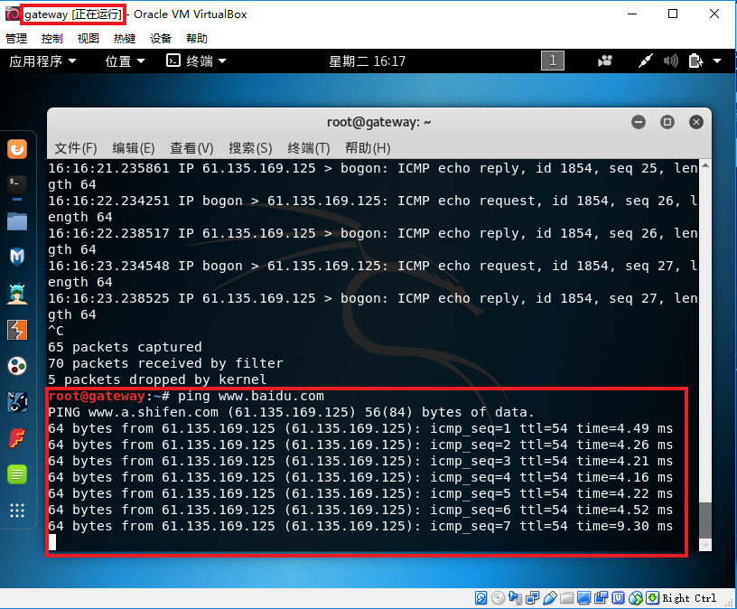

# chap0x01 基于VirtualBox的网络攻防基础环境搭建实例讲解 实验报告 #

----------
### 一 实验目标 ###
- 节点：靶机、网关、攻击者主机
- 连通性
   - 靶机可以直接访问攻击者主机
   - 攻击者主机无法直接访问靶机
   - 网关可以直接访问攻击者主机和靶机
   - 靶机的所有对外上下行流量必须经过网关
   - 所有节点均可以访问互联网
- 其他要求
   - 所有节点制作成基础镜像（多重加载的虚拟硬盘）

----------
### 二 实验网络拓扑图

----------
### 三 虚拟机网卡设置

本次实验使用了三个虚拟机，分别代表attacker（攻击者）、gateway（网关）、drone（靶机）

其中网卡设置如下：

- 攻击者
   - NAT网络，与网关eth0处于同一网段，eth0的IP地址:10.0.2.5
- 网关
   - NAT网络，eth0的IP地址:10.0.2.6
   - intnet网络，eth1的IP地址:192.168.56.106
- 靶机
   - intnet网络，与网关eth1处于同一网段，eth0的IP地址:192.168.56.105

1. 靶机网卡设置

2. 网关网卡设置

3. 攻击者网卡设置

----------
### 四 相关配置
- 靶机
  - 添加默认网关

        route add defaultgw 192.168.56.106

- 网关
  - 开启转发服务  

        echo 1 > /proc/sys/net/ipv4/ip_forward  
        iptables -t nat -A POSTROUTING -o eth0 -s 192.168.56.105/24 -j MASQUERADE

  - 保存iptables表

        iptables-save -c > iptables.rules

  - 开启dhcp服务

        vi /etc/network/interfaces  
        "auto eth0"  
        "iface eth0 inet dhcp"

- 攻击者

   - 开启dhcp服务

         vi /etc/network/interfaces  
         "auto eth0"  
         "iface eth0 inet dhcp"

----------
### 五 实验结果 ###
1. 靶机可以直接访问攻击者主机(攻击者IP：10.0.2.5)

2. 攻击者主机无法直接访问靶机(靶机IP：192.168.56.105)

3. 网关可以直接访问攻击者主机和靶机(攻击者IP：10.0.2.5，靶机IP：192.168.56.105)

4. 靶机的所有对外上下行流量必须经过网关

5. 所有节点均可以访问互联网

6. 所有节点制作成基础镜像（多重加载的虚拟硬盘）

