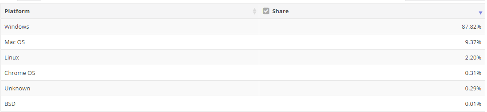
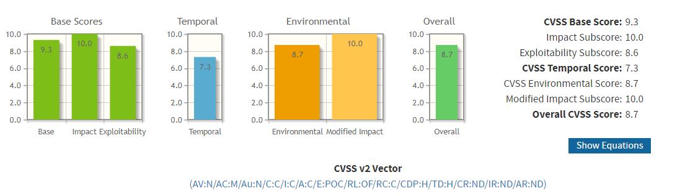
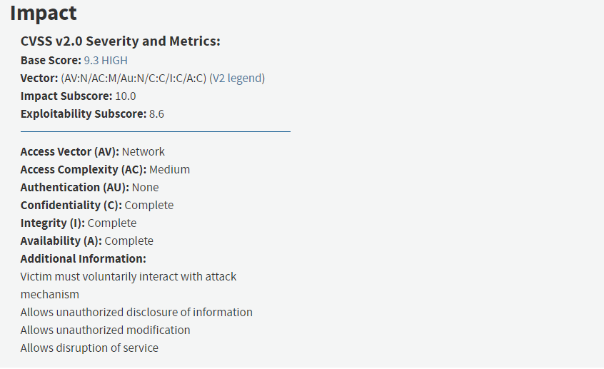
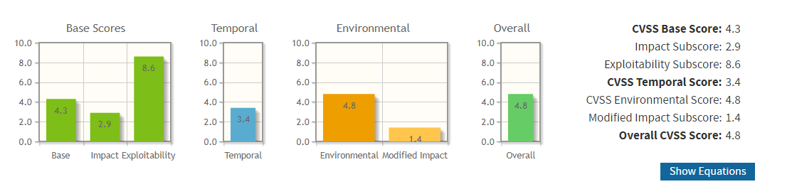
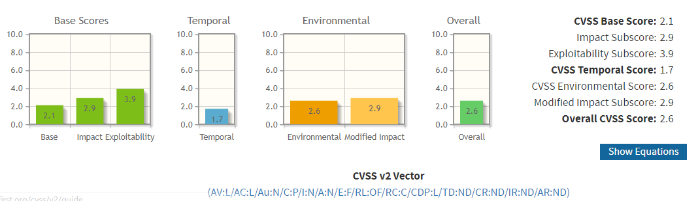
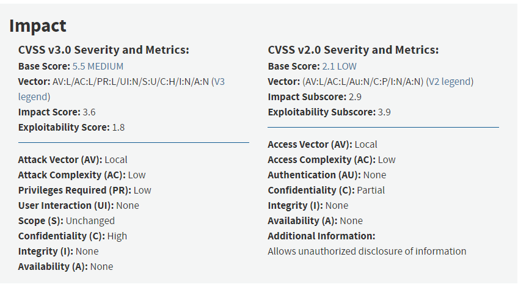

# chap0x02 CVSS与漏洞评分实例讲解

---

## CVSS
 - The Common Vulnerability Scoring System (CVSS)通用漏洞评分系统
 - 一个公开的系统，准确、一致的为行业和组织等提供漏洞影响分数，利用该系统可对漏洞进行评分，进而影响漏洞修复的优先级
 - CVSS的两个常见用途：1、 确定漏洞修复活动的优先级。2、 计算在一个系统上发现的漏洞的严重性

## CVSS评分标准

- CVSS评分由三个部分构成
  - Base
  - 漏洞本身固有的一些特点以及这些特点可能会造成的影响
    - Access Vector(AV)
      - 漏洞的利用方式，分为物理接触、子网等相邻网络、远程网络
    - Access Complesity(AC)
      - 接入系统利用漏洞的复杂度
    - Authentication(Au)
      - 利用漏洞是否需要进行身份认证，分为多次、一次、不需要
    - Confidentiality Impact(C)
      - 影响机密性的程度，分为无、部分、全部
    - Integrity Impact(I)
      - 影响完整性的程度，分为无、部分、全部
    - Availability Impact(A)
      - 影响可用性的程度，分为无、部分、全部
  - Temporal
    - Exploitability(E)
      - 漏洞的利用技术或代码可用性
    - Remediation Level(RL)
      - 漏洞的补救状态
    - Report Confidence(RC)
      - 安全漏洞报告的可信度
  - Environmental
    - Collateral Damage Potential(CDP)
      - 漏洞可能造成的伤害
    - Target Distribution(TD)
      - 漏洞的分布范围
    - Security Requirements(CR,IR,AR)

## CVSS与漏洞评分实例讲解

---
#### 1. CVE-2014-6332
 - 该漏洞选取自老师您的文档里面提到的漏洞

 - 通过查找资料可知以下内容
   - 该漏洞是IE远程代码执行漏洞
   - 2014年11月被微软修复
   - 存在于所有Windows版本
   - 缺陷代码至少已有19年的历史
   - 可以被远程利用
   - 可以做到接管用户的计算机
   - 漏洞涉及到数据值操作和远程代码执行
   - 网上有可以直接利用漏洞的代码
   - 无须认证、绕过增强保护系统
   - Exploitation is tricky, partially because array elements are a fixed size

  - 根据信息，对漏洞进行评判
    - Base
      - Attack Vector：Network(可以远程进行)
      - Access Complesity：Medium(漏洞使用有难度，但并没有达到高的程度)
      - Authentication：None(不需要认证)
      - CIA：Complete(可以做到接管用户的计算机)
    - Temporal
      - Exploitability：POC(有很多的代码参考样例)
      - Remediation Level：OF(2014年漏洞被发现后，微软及时发布了补丁)
      - Report Confidence：C(得到官方承认)
    - Environmental
      - Collateral Damage Potential：H(可以做到接管用户的计算机)
      - Target Distribution：H(2018年8月，windows系统市场份额占比87.82%，属于H等级)
      - Security Requirements：ND

- 2018年8月全球操作系统市场份额

- CVSS结果，漏洞最终得分为8.7，属于高危漏洞级别

- 参考了NVD上的关于CVE-2014-6332的漏洞分析，但只有关于Base Score部分，其他两个部分是我根据资料自行判断的

- NVD上给出的分析

----

#### 2. CVE-2018-11620
- 通过查找相关资料得到以下信息
  - 该漏洞来自Foxit Readers
  - 该漏洞于2018年3月21号向供应商报告
  - 攻击者可远程攻击
  - 需要进行交互
  - 会导致用户泄露敏感信息
  - 与其他漏洞结合可在当前进程的上下文执行任何代码
  - Foxit已发布更新修复漏洞

- 根据信息，对漏洞进行评判
    - Base
      - Attack Vector：Network(可远程进行)
      - Access Complesity：Medium(漏洞使用有难度，涉及到了交互，但并没有达到高的程度)
      - Authentication：None(不需要认证)
      - Confidentiality Impact：Partial(会导致用户泄露敏感信息,但没到全部泄露的程度)
      - Integrity Impact：None(对系统的完整性没有影响)
      - Availability Impact:None(对系统的可用性没有影响)
    - Temporal
      - Exploitability：POC(查询到漏洞利用代码，需要对特点的dll配置进行攻击)
      - Remediation Level：OF(Foxit已发布更新修复漏洞)
      - Report Confidence：C(得到官方承认)
    - Environmental
      - Collateral Damage Potential：LM(只讨论这个漏洞的情况下，稍微严重的方面有信息曝光和免费使用软件)
      - Target Distribution：ND(没查到)
      - Security Requirements：ND

- CVSS结果，漏洞最终得分为5.4，属于中级漏洞级别

- 参考了NVD上的关于CVE-2018-11620的漏洞分析，但只有关于Base Score部分，其他两个部分是我根据资料自行判断的

- NVD上给出的分析

---
#### 3. CVE-2017-2622

- 通过查找相关资料得到以下信息
  - 漏洞来自OpenStack Workflow(mistral)
  - Mistral是Mirantis公司为Openstack开发的工作流组件
  - Openstack是一个开源的云计算管理平台项目
  - 服务日志目录不正确地使其可读
  - 需要本地访问
  - 恶意用户可以利用漏洞访问敏感信息
  - 官方已经升级版本
  - 敏感信息和日志的设置是world readable

- 根据信息，对漏洞进行评判
    - Base
      - Attack Vector：Local(需要用户在本机上直接进行操作，属于本地访问)
      - Access Complesity：Low(敏感信息是直接可以访问的，攻击复杂度很低)
      - Authentication：None(world readable)
      - Confidentiality Impact：Partial(会导致用户泄露敏感信息,但没到全部泄露的程度)
      - Integrity Impact：None(对系统的完整性没有影响)
      - Availability Impact:None(对系统的可用性没有影响)
    - Temporal
      - Exploitability：F(漏洞利用难度低，可利用性高)
      - Remediation Level：OF(官方已发布更新修复漏洞)
      - Report Confidence：C(得到官方承认)
    - Environmental
      - Collateral Damage Potential：LM(只讨论这个漏洞的情况下，只有泄露部分敏感信息这个部分)
      - Target Distribution：ND(没查到)
      - Security Requirements：ND

- CVSS结果，漏洞最终得分为2.6，属于低级漏洞级别

- 参考了NVD上的关于CVE-2017-2622的漏洞分析，但只有关于Base Score部分，其他两个部分是我根据资料自行判断的

- NVD上给出的分析

---

### 相关问题

- 不太清楚Exploitability中POC和F的评判等级的差别
- 该评判漏洞系统有没有什么缺点

---

### 参考资料

- [A Complete Guide to the Common Vulnerability Scoring System](https://www.first.org/cvss/v2/guide#2-1-Base-Metrics)
- [win95+ie3-win10+ie11全版本执行漏洞](https://www.nigesb.com/cve-2014-6332-poc.html)
- [IBM X-Force Researcher Finds Significant Vulnerability in Microsoft Windows](https://securityintelligence.com/ibm-x-force-researcher-finds-significant-vulnerability-in-microsoft-windows/#.VGsPutyUeXk)
- [Microsoft 安全公告 MS14-064 - 严重](https://docs.microsoft.com/zh-cn/security-updates/Securitybulletins/2014/ms14-064)
- [Foxitsoftware Foxit Reader 9.0.1.1049](http://www.security-database.com/cpe.php?detail=cpe:/a:foxitsoftware:foxit_reader:9.0.1.1049)
- [Foxit Reader ConvertToPDF_x86 JPG Parsing Out-Of-Bounds Read Information Disclosure Vulnerability](https://www.zerodayinitiative.com/advisories/ZDI-18-697/)
- [RHSA-2017:1584 - Security Advisory](https://access.redhat.com/errata/RHSA-2017:1584)
- [Bug 1420992 - (CVE-2017-2622) CVE-2017-2622 openstack-mistral: /var/log/mistral/ is world readable](https://bugzilla.redhat.com/show_bug.cgi?id=CVE-2017-2622)

