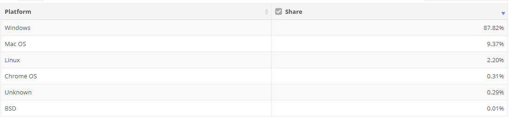
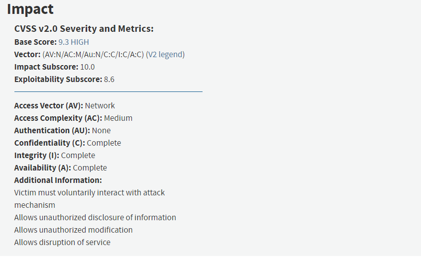
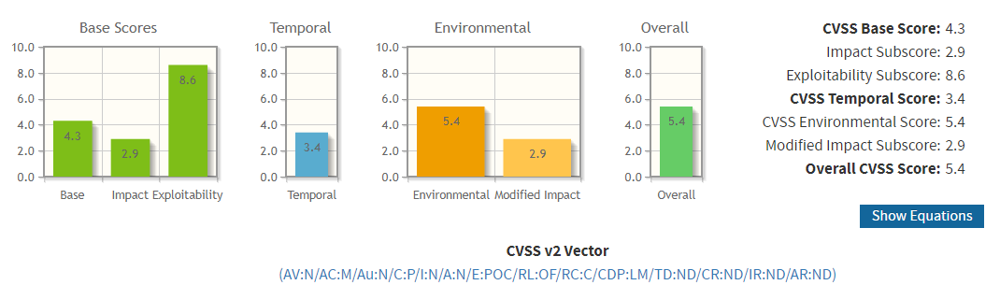
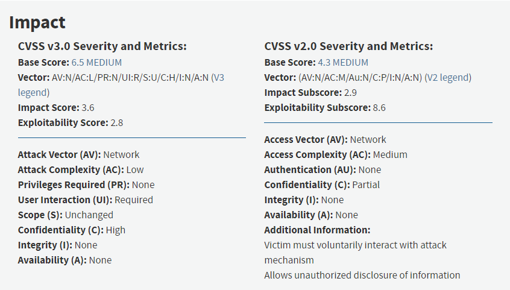

# chap0x02 CVSS与漏洞评分实例讲解

---

## CVSS
 - The Common Vulnerability Scoring System (CVSS)通用漏洞评分系统
 - 一个公开的系统，准确、一致的为行业和组织等提供漏洞影响分数，利用该系统可对漏洞进行评分，进而影响漏洞修复的优先级
 - CVSS的两个常见用途：1、 确定漏洞修复活动的优先级。2、 计算在一个系统上发现的漏洞的严重性

## CVSS评分标准

- CVSS评分由三个部分构成
  - Base
  - 漏洞本身固有的一些特点以及这些特点可能会造成的影响
    - Access Vector(AV)
      - 漏洞的利用方式，分为物理接触、子网等相邻网络、远程网络
    - Access Complesity(AC)
      - 接入系统利用漏洞的复杂度
    - Authentication(Au)
      - 利用漏洞是否需要进行身份认证，分为多次、一次、不需要
    - Confidentiality Impact(C)
      - 影响机密性的程度，分为无、部分、全部
    - Integrity Impact(I)
      - 影响完整性的程度，分为无、部分、全部
    - Availability Impact(A)
      - 影响可用性的程度，分为无、部分、全部
  - Temporal
    - Exploitability(E)
      - 漏洞的利用技术或代码可用性
    - Remediation Level(RL)
      - 漏洞的补救状态
    - Report Confidence(RC)
      - 安全漏洞报告的可信度
  - Environmental
    - Collateral Damage Potential(CDP)
      - 漏洞可能造成的伤害
    - Target Distribution(TD)
      - 漏洞的分布范围
    - Security Requirements(CR,IR,AR)

### CVSS与漏洞评分实例讲解

---
#### CVE-2014-6332
 - 该漏洞选取自老师您的文档里面提到的漏洞

 - 通过查找资料可知以下内容
   - 该漏洞是IE远程代码执行漏洞
   - 2014年11月被微软修复
   - 存在于所有Windows版本
   - 缺陷代码至少已有19年的历史
   - 可以被远程利用
   - 可以做到接管用户的计算机
   - 漏洞涉及到数据值操作和远程代码执行
   - 网上有可以直接利用漏洞的代码
   - 无须认证、绕过增强保护系统
   - Exploitation is tricky, partially because array elements are a fixed size

  - 根据信息，对漏洞进行评判
    - Base
      - Attack Vector：Network
      - Access Complesity：Medium(漏洞使用有难度，但并没有达到高的程度)
      - Authentication：None(不需要认证)
      - CIA：Complete(可以做到接管用户的计算机)
    - Temporal
      - Exploitability：POC(有很多的代码参考样例)
      - Remediation Level：OF(2014年漏洞被发现后，微软及时发布了补丁)
      - Report Confidence：C(得到官方承认)
    - Environmental
      - Collateral Damage Potential：H(可以做到接管用户的计算机)
      - Target Distribution：H(2018年8月，windows系统市场份额占比87.82%，属于H等级)
      - Security Requirements：ND

- 2018年8月全球操作系统市场份额

- CVSS结果，漏洞最终得分为8.7，属于高危漏洞级别

- 参考了NVD上的关于CVE-2014-6332的漏洞分析，但只有关于Base Score部分，其他两个部分是我根据资料自行判断的

- NVD上给出的分析

----

#### CVE-2018-11620
- 通过查找相关资料得到以下信息
  - 该漏洞来自Foxit Readers
  - 该漏洞于2018年3月21号向供应商报告
  - 攻击者可远程攻击
  - 需要进行交互
  - 会导致用户泄露敏感信息
  - 与其他漏洞结合可在当前进程的上下文执行任何代码
  - Foxit已发布更新修复漏洞

- 根据信息，对漏洞进行评判
    - Base
      - Attack Vector：Network
      - Access Complesity：Medium(漏洞使用有难度，涉及到了交互，但并没有达到高的程度)
      - Authentication：None
      - Confidentiality Impact：Partial(会导致用户泄露敏感信息,但没到全部泄露的底部)
      - Integrity Impact：None(对系统的完整性没有影响)
      - Availability Impact:None(对系统的可用性没有影响)
    - Temporal
      - Exploitability：POC(没查询到漏洞利用代码，只知道需要对特点的dll进行配置进行攻击)
      - Remediation Level：OF(Foxit已发布更新修复漏洞)
      - Report Confidence：C(得到官方承认)
    - Environmental
      - Collateral Damage Potential：LM(只讨论这个漏洞的情况下，稍微严重的方面有信息曝光和免费使用软件)
      - Target Distribution：ND(没查到)
      - Security Requirements：CR设置为Medium，其他为LOW

- CVSS结果，漏洞最终得分为4.8，属于中级漏洞级别

- 参考了NVD上的关于CVE-2018-11620的漏洞分析，但只有关于Base Score部分，其他两个部分是我根据资料自行判断的

- NVD上给出的分析

### 参考资料
- [win95+ie3-win10+ie11全版本执行漏洞](https://www.nigesb.com/cve-2014-6332-poc.html)
- [A Complete Guide to the Common Vulnerability Scoring System](https://www.first.org/cvss/v2/guide#2-1-Base-Metrics)
- [IBM X-Force Researcher Finds Significant Vulnerability in Microsoft Windows](https://securityintelligence.com/ibm-x-force-researcher-finds-significant-vulnerability-in-microsoft-windows/#.VGsPutyUeXk)
- [Foxitsoftware Foxit Reader 9.0.1.1049](http://www.security-database.com/cpe.php?detail=cpe:/a:foxitsoftware:foxit_reader:9.0.1.1049)
