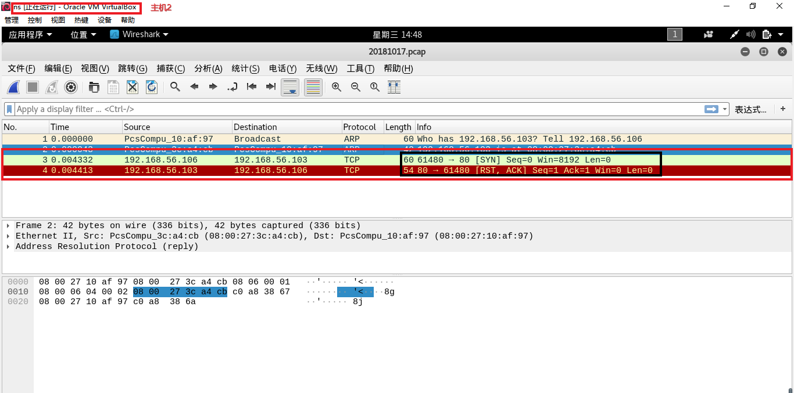
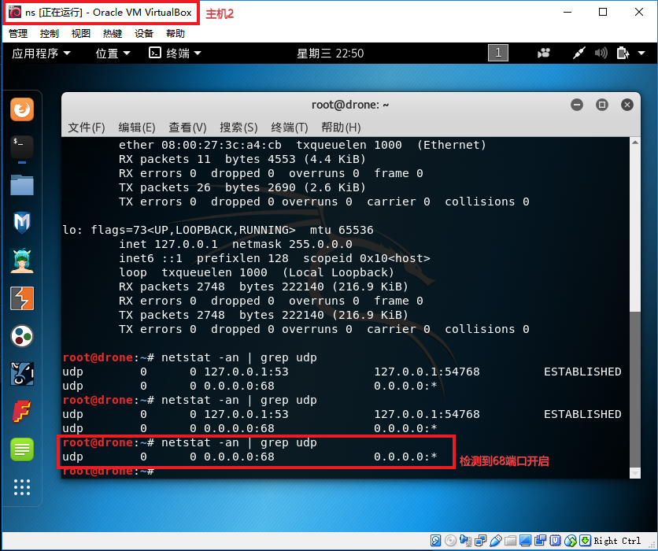

# chap0x05 端口扫描实验报告

## 1、 实验目标

- TCP connect scan

- TCP stealth scan

- TCP XMAS scan

- UDP scan

## 2、 实验拓扑

- 主机1
    - IP:192.168.56.106

    - 作用：扫描主机2上的端口

- 主机2
    - IP:192.168.56.103

    - 作用：提供端口给主机1扫描

- 网络拓扑图

## 3、 实验过程

### (1) TCP connect scan

端口开启时的情况

端口关闭时的情况

主机2没有开启80/tcp端口时，运行py文件对主机2进行端口扫描

主机2进行抓包

wireshark分析抓包情况，确实如端口关闭的图所示，主机1发送了SYN包，主机2回复了RST包

主机2开启80/tcp端口

    php -S 0.0.0.0:80

主机1使用nmap对主机2上端口进行扫描，检测到80/tcp端口

主机2开启80/tcp端口后，运行py文件对主机2进行端口扫描

wireshark分析抓包情况，包交换确实如端口打开的图所示，主机1发送了SYN包，主机2回复SYN+ACK包，主机1再次发送ACK+RST包，完成三次握手

- [TCP_connect_scan_two.py](sources/TCP_connect_scan_two.py)

----

### (2) TCP stealth scan

端口开启时的情况

端口关闭时的情况

主机2没有开启80/tcp端口时，运行py文件对主机2进行端口扫描，显示没有开启端口

主机2进行抓包，wireshark分析抓包情况，确实如端口关闭的图所示，主机1发送了SYN包，主机2回复了RST包

主机2开启80/tcp端口后，运行py文件对主机2进行端口扫描，结果显示已开启端口

主机2开启80/tcp端口后，运行py文件对主机2进行端口扫描，wireshark分析抓包情况，包交换确实如端口打开的图所示。主机1发送了SYN端口，主机2回复SYN+ACK包，主机1再回复RST包

- [TCP_stealth_scan.py](sources/TCP_stealth_scan.py)

----

### (3) XMAS scan

端口开启时的情况

端口关闭时的情况

端口开启过滤时的情况

主机2没有开启80/tcp端口时，运行py文件对主机2进行端口扫描，显示端口关闭

主机2进行抓包，wireshark分析抓包情况，确实如端口关闭的图所示，主机2回复了RST包

主机2开启80/tcp端口后，主机1运行py文件对主机2进行端口扫描，显示端口已经开启

主机2开启80/tcp端口后，运行py文件对主机2进行端口扫描，wireshark分析抓包情况，包交换确实如端口打开的图所示，主机1发送Flags包，但没有从主机2得到响应

- [XMAS_scan.py](sources/XMAS_scan.py)

-----

### (4) UDP  scan

端口开启时的情况

端口关闭时的情况

端口过滤时的情况

端口为开启或过滤时的情况

主机2没有开启udp端口时，运行py文件对主机2进行端口扫描，显示端口已经关闭

主机2进行抓包，wireshark分析抓包情况，确实如端口关闭的图所示，主机1发送UDP包，主机2回复了ICMP包

扫描本地端口，发现68/udp端口为开启状态

使用nmap检测主机2的端口是否开启,结果显示为开启

运行py文件，检测主机2端口是否开启，结果显示为已经开启

开启主机2上的wireshark对包进行分析，发现只有主机1发过来的包，主机2没有返回任何包，说明端口是开放或过滤情况

- [UDP_scan.py](sources/UDP_scan.py)

----

## 实验遇到的问题

- 原本在UDP端口扫描时，打算扫描53端口，但扫描失败了
    - 使用了 `nc -ulp 53`命令，在本地通过`netsat -an | grep udp`查看发现是已经开启了53端口，但主机1通过nmap扫描发现53端口依旧是关闭的
    - 改使用`nc -u -l -p 53 < /etc/passwd`后，可以实现扫描53端口时为开放或过滤器状态

----

## 参考资料

- [chap0x05 TCP UDP scan实验提交 #4](https://github.com/CUCCS/2018-NS-Public-xaZKX/pull/4)

- [Port Scanning using Scapy](https://resources.infosecinstitute.com/port-scanning-using-scapy/)