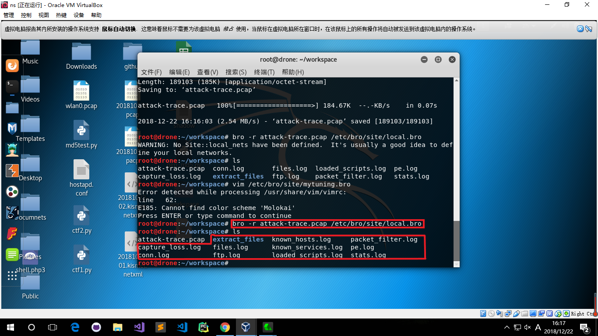

# chap0x12 实战Bro网络入侵取证

## 实验环境准备

1. 安装bro

        apt-get install bro bro-aux

2. 实验环境基本信息

3. 创建workspace文件夹,下载本次实验分析pacp文件

        mkdir workspace
        cd workspace
        wget http://sec.cuc.edu.cn/huangwei/textbook/ns/chap0x12/attack-trace.pcap

## 编辑bro配置文件

1. 编辑`/etc/bro/site/local.bro`，在文件尾部追加两行新配置代码

        # 提取所有文件
        @load frameworks/files/extract-all-files
        # 加载脚本
        @load mytuning.bro 

2. 在`/etc/bro/site/`目录下创建新文件mytuning.bro，并在其中添加代码
        
        redef ignore_checksums = T;

        # 通常，Bro的事件引擎将丢弃没有有效校验和的数据包。如果想要在系统上分析本地生成/捕获流量，所有发送/捕获的数据包将具有不良的校验和，因为它们尚未由NIC计算，因此这些数据包将不会在Bro策略脚本中进行分析，所以要设置成忽略校验和验证

## 使用bro自动化分析pcap文件

1. 执行指令分析pcap包

        bro -r attack-trace.pcap /etc/bro/site/local.bro

在同级目录下出现分析文件

编辑`/etc/bro/site/mytuning.bro`，添加代码

        redef Site::local_nets = { 192.150.11.0/24 };

重新运行指令，发现解决了警告信息，多生成了`known_hosts.log`和`known_services.log`文件，这两个文件报告在当前流量（数据包文件）中发现了本地网络IP和该IP关联的已知服务信息

2. 分析相关文件

先对`extract_files`文件夹下面的文件进行分析，发现其是一个可执行文件

        file extract-1240198114.648099-FTP_DATA-FHUsSu3rWdP07eRE4l

将该文件上传到[virustotal](https://virustotal.com/),发现是已知的后门程序，因此可以进行逆向倒推，寻找入侵线索

3. 逆向倒推

阅读`/usr/share/bro/base/files/extract/main.bro`源代码，发文件名的最右一个-右侧对应的字符串`FHUsSu3rWdP07eRE4l`是`files.log`中的文件唯一标识

查看`files.log`，发现该文件提取自网络会话标识`C2RUFy1b3nXDaaqgSh`的FTP会话

通过`C2RUFy1b3nXDaaqgSh`在`conn.log`文件中寻找对应的IP五元组信息

我们发现该PE文件来自于IPv4地址为：`98.114.205.102`的主机

## Bro的一些其他技巧

- 设置显示捕获的FTP登陆口令

编辑`etc/bro/site/mytuning.bro`文件，添加一行代码，使`ftp.log`中显示捕获的FTP登陆口令

        redef FTP::default_capture_password = T;

- SMB协议识别

编辑`/etc/bro/site/local.bro`，添加一行代码，查看`known_services.log`使其能识别出SMB协议流量

        @load protocols/smb

## pcap attack trace

1. 查看主机信息

使用tshark查看主机信息

        # -r 读取本地文件
        # -z 设置统计参数
        # -q 只在结束捕获时输出数据，针对于统计类的命令非常有用
        # -n 禁止网络对象名称解析
        tshark -r attack-trace.pcap -z ip_hosts,tree -qn

2. 查看攻击者

使用tshark查看攻击者，发现攻击者为`98.114.205.102`

        # 设置读取过滤表达式（read filter expression）,只查找SYN包
        tshark -r attack-trace.pcap -R "tcp.flags==0x02" -n

查询IP地址

3. 查看攻击持续时间

使用tshark查看攻击时间，发现攻击时间为16.22秒左右

        capinfos attack-trace.pcap

## 参考

- [⽹络安全 第⼗⼆章 计算机取证](http://sec.cuc.edu.cn/huangwei/course/2016/nsLecture0x12.pdf)

- [第十二章实验](http://sec.cuc.edu.cn/huangwei/textbook/ns/chap0x12/exp.html)

- [基于bro的计算机入侵取证实战分析](https://www.freebuf.com/articles/system/135843.html)